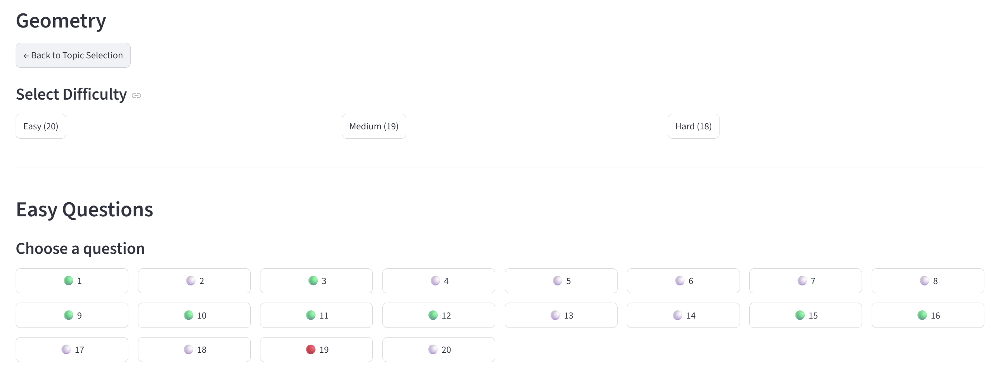

# Adaptive Learning Platform for Middle School Math

An AI-powered adaptive learning system with:
- Machine learning question tagging
- Dynamic difficulty recalibration
- Teacher-in-the-loop review workflows
- Real-time PostgreSQL analytics

<p align="center">
  
</p>

---

# Table of Contents

- [Demo](#demo)
- [Project Overview](#project-overview)
- [Features](#features)
  - [Student Features](#student-features)
  - [Teacher Features](#teacher-features)
  - [Machine Learning Features](#machine-learning-features)
  - [Backend Features](#backend-features)
- [System Architecture](#system-architecture)
- [Machine Learning Logic](#machine-learning-logic)
  - [Topic Classification](#topic-classification)
  - [Difficulty Classification](#difficulty-classification)
- [Adaptive Difficulty Logic](#adaptive-difficulty-logic)
  - [Student-Level Adaptation](#student-level-adaptation)
  - [Question-Level Difficulty Recalibration](#question-level-difficulty-recalibration)
  - [Recalibration Workflow](#recalibration-workflow)
- [Teacher Review Workflow](#teacher-review-workflow)
  - [New Question Review](#new-question-review)
  - [Difficulty Review Workflow](#difficulty-review-workflow)
- [Project Structure](#project-structure)
- [Local Setup](#local-setup)
- [Deployment](#deployment)
- [Future Improvements](#future-improvements)

---

# Demo

## Student login Interface
<p align="center">
  
</p>

---
## Student Topic Selection
<p align="center">
  
</p>

---

## Performance Tracking
<p align="center">
  
</p>

---

# Project Overview

This project simulates a real-world adaptive learning platform commonly used in educational technology systems.

Students can:
- Practice middle school math questions
- Receive dynamically adjusted question difficulty
- Track learning progress
- Navigate through adaptive question flows

Teachers can:
- Review AI-generated questions
- Approve or reject content
- Override predicted topics and difficulties
- Review automatically recalibrated question difficulties

The platform continuously analyzes student performance and updates question difficulty recommendations using real-time PostgreSQL analytics.

---

# Features

## Student Features

- Student login system
- Adaptive difficulty progression
- Instant answer validation
- Numeric equivalence checking
- Progress persistence
- Question status tracking
- Previous/next question navigation
- Dynamic question selection

---

## Teacher Features

- Teacher authentication
- AI-assisted question review
- Topic and difficulty override
- Difficulty recalibration review queue
- Human-in-the-loop moderation workflow

---

## Machine Learning Features

### Topic Prediction
- SentenceTransformer embeddings
- Cosine similarity matching
- Topic centroid classification

### Difficulty Prediction
- Feature engineering
- Logistic Regression classifier
- Question complexity analysis

### Dynamic Difficulty Recalibration
- Real-time student attempt analytics
- Average attempts-until-correct tracking
- Automatic mismatch detection
- Teacher review escalation

---

## Backend Features

- PostgreSQL cloud database (Neon)
- Persistent cloud storage
- Real-time analytics updates
- Streamlit cloud deployment
- SQLAlchemy database layer

---

# System Architecture

```text
Student UI (Streamlit)
        ↓
PostgreSQL Database (Neon)
        ↓
Machine Learning Models
   ├── Topic Embeddings
   ├── Difficulty Prediction
   └── Difficulty Recalibration
        ↓
Teacher Review System
```
---

# Machine Learning Logic

## Topic Classification

Topic prediction uses semantic embeddings generated by:

```python
SentenceTransformer("all-MiniLM-L6-v2")
```

Workflow:

```text
Question
    ↓
Embedding Vector
    ↓
Cosine Similarity
    ↓
Closest Topic Centroid
```

---

## Difficulty Classification

Difficulty prediction uses feature engineering and Logistic Regression.

Extracted features include:
- Word count
- Character count
- Number count
- Fraction detection
- Decimal detection
- Equation detection
- Multi-step indicators
- Operation complexity

Model:

```python
LogisticRegression(max_iter=1000)
```

---

# Adaptive Difficulty Logic

The platform dynamically adjusts student difficulty levels based on recent performance.

## Student-Level Adaptation

### Promotion Logic

```text
Recent accuracy >= 80%
→ Increase difficulty
```

### Demotion Logic

```text
Recent accuracy <= 40%
→ Decrease difficulty
```

---

## Question-Level Difficulty Recalibration

The system continuously analyzes how many attempts students require before answering correctly.

### Difficulty Thresholds

| Average Attempts Until Correct | Recommended Difficulty |
|---|---|
| 1.00 – 1.40 | easy |
| 1.41 – 2.20 | medium |
| 2.21+ | hard |

---

## Recalibration Workflow

```text
Student Attempts
        ↓
Real-Time PostgreSQL Analytics
        ↓
Difficulty Recommendation
        ↓
Mismatch Detection
        ↓
Teacher Review Queue
        ↓
Teacher Final Decision
```

---

# Teacher Review Workflow

## New Question Review

1. Questions are added to:
   ```text
   new_questions.csv
   ```

2. AI auto-tags:
   - Topic
   - Difficulty

3. Questions are inserted into:
   ```text
   review_questions
   ```

4. Teachers:
   - Approve
   - Reject
   - Override labels

5. Approved questions enter:
   ```text
   questions
   ```

---

## Difficulty Review Workflow

Questions are automatically flagged when:
- Student performance disagrees with labeled difficulty
- Minimum student sample threshold is reached

Teachers can:
- Keep current difficulty
- Override difficulty
- Apply final decision directly to question bank

---

# Project Structure

```text
adaptive-learning-ai/
│
├── app.py
├── requirements.txt
├── README.md
│
├── .streamlit/
│   └── secrets.toml
│
├── data/
│   ├── new_questions.csv
│   └── student_progress.db
│
├── models/
│   ├── difficulty_feature_model.pkl
│   ├── topic_centroids.pkl
│   └── embedding_model_name.pkl
│
├── src/
│   ├── db.py
│   ├── init_postgres.py
│   ├── ingest_questions.py
│   ├── predict.py
│   ├── train_models.py
│   └── create_teachers.py
│
└── images/
```

---

# Local Setup

## Clone Repository

```bash
git clone https://github.com/YOUR_USERNAME/adaptive-learning-ai.git

cd adaptive-learning-ai
```

---

## Create Virtual Environment

### Windows

```bash
python -m venv venv

venv\Scripts\activate
```

---

## Install Dependencies

```bash
pip install -r requirements.txt
```

---

## Configure Environment

Create:

```text
.streamlit/secrets.toml
```

Add:

```toml
DATABASE_URL = "YOUR_NEON_DATABASE_URL"
```

---

## Run Application

```bash
streamlit run app.py
```

---

# Deployment

The application is deployed using:

- Streamlit Community Cloud
- Neon PostgreSQL

The deployed version supports:
- Persistent cloud database storage
- Real-time analytics
- Teacher review workflows
- Student progress tracking

---

# Future Improvements

- Knowledge tracing models
- Personalized learning paths
- LLM-generated hints
- Multi-step solution grading
- Student mastery estimation
- Teacher analytics dashboard
- Semantic vector search
- RAG-based tutoring
- AI-generated explanations
- Difficulty calibration using Item Response Theory (IRT)

